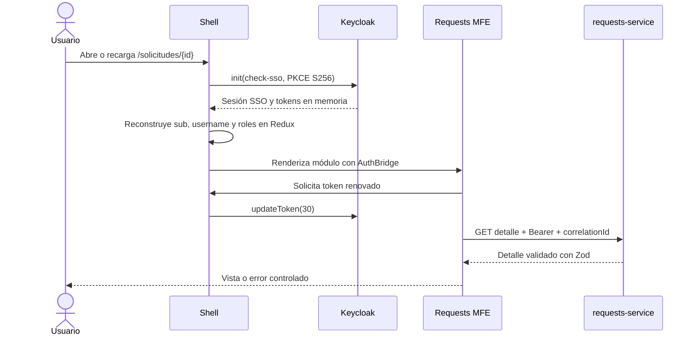

# Secuencia de autenticación y recarga A6

```mermaid
sequenceDiagram
 actor U as Usuario
 participant S as Shell
 participant K as Keycloak
 participant R as Requests MFE
 participant API as requests-service
 U->>S: Abre o recarga /solicitudes/{id}
 S->>K: init(check-sso, PKCE S256)
 K-->>S: Sesión SSO y tokens en memoria
 S->>S: Reconstruye sub, username y roles en Redux
 S->>R: Renderiza módulo con AuthBridge
 R->>S: Solicita token renovado
 S->>K: updateToken(30)
 R->>API: GET detalle + Bearer + correlationId
 API-->>R: Detalle validado con Zod
 R-->>U: Vista o error controlado
```
