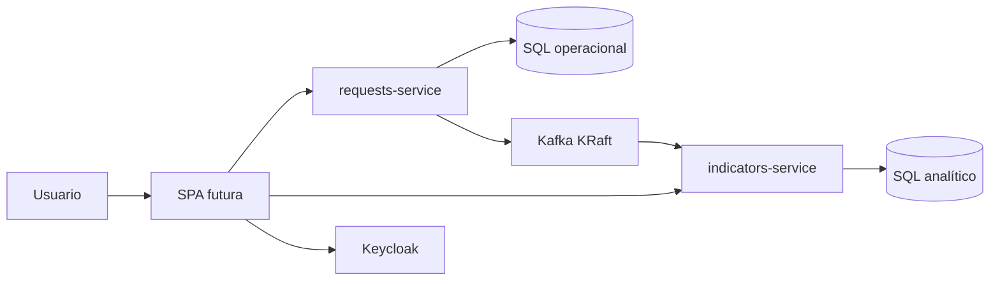

# Contenedores

```mermaid
flowchart LR
 U[Usuario] --> WEB[SPA futura]
 WEB --> R[requests-service]
 WEB --> I[indicators-service]
 WEB --> K[Keycloak]
 R --> O[(SQL operacional)]
 R --> KF[Kafka KRaft]
 KF --> I
 I --> A[(SQL analítico)]
```
