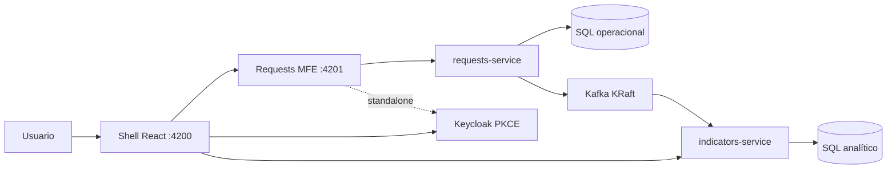

# Contenedores

```mermaid
flowchart LR
 U[Usuario] --> SH[Shell React :4200]
 SH --> MFE[Requests MFE :4201]
 SH --> I[indicators-service]
 MFE --> R[requests-service]
 SH --> K[Keycloak PKCE]
 MFE -. standalone .-> K
 R --> O[(SQL operacional)]
 R --> KF[Kafka KRaft]
 KF --> I
 I --> A[(SQL analítico)]
```
