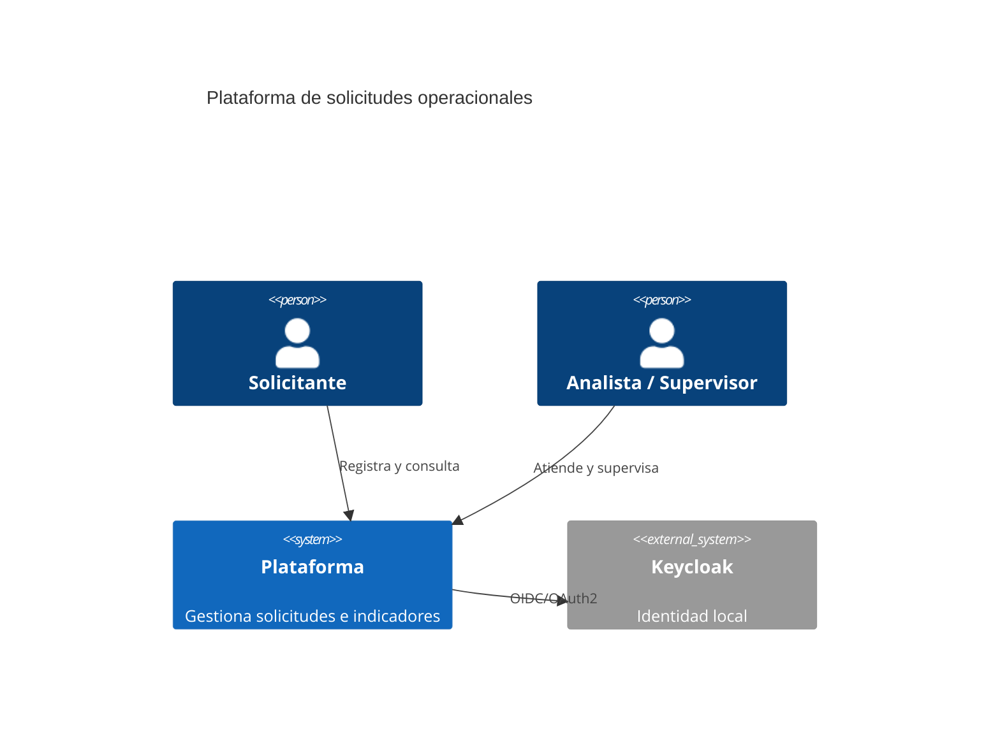

# Contexto

```mermaid
C4Context
 title Plataforma de solicitudes operacionales
 Person(requester, "Solicitante")
 Person(staff, "Analista / Supervisor")
 System(platform, "Plataforma", "Gestiona solicitudes e indicadores")
 System_Ext(idp, "Keycloak", "Identidad local")
 Rel(requester, platform, "Registra y consulta")
 Rel(staff, platform, "Atiende y supervisa")
 Rel(platform, idp, "OIDC/OAuth2")
```
