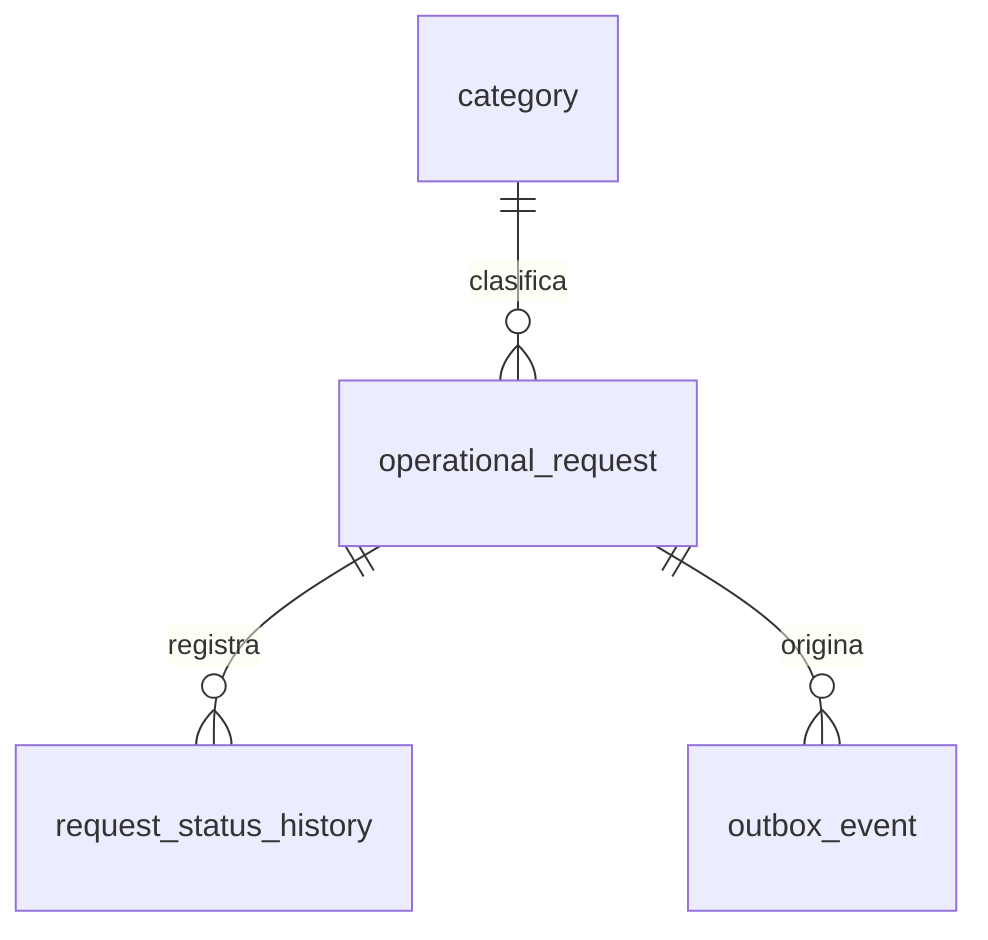
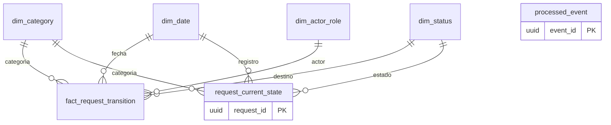

# Modelos de datos

El operacional permanece normalizado. Outbox añade estado, intentos, próximo intento, lock temporal, error limitado y fecha de publicación.

El analítico conserva `fact_request_transition` como historial. `request_current_state` contiene una fila por solicitud y evita sumar cada transición como una nueva solicitud al calcular estado o categoría actuales. `processed_event.event_id` y `fact_request_transition.event_id` son únicos.

