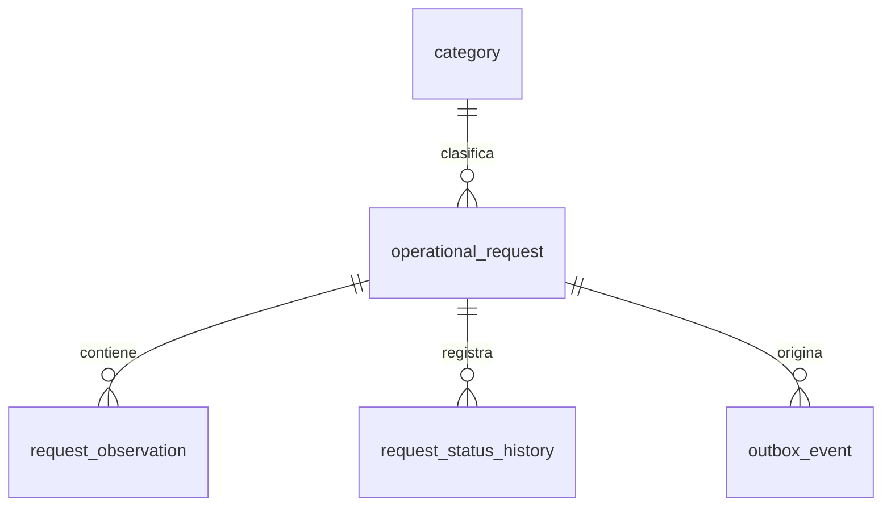
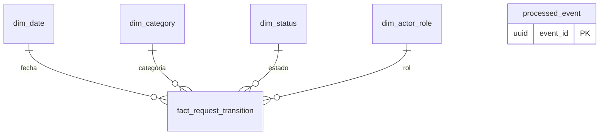

# Modelos de datos

El modelo operacional está normalizado para integridad y transacciones. El analítico es una estrella simplificada: una tabla de hechos referencia dimensiones y favorece agregaciones. Son bases físicamente separadas en local para conservar propiedad y ciclo de vida independiente.

