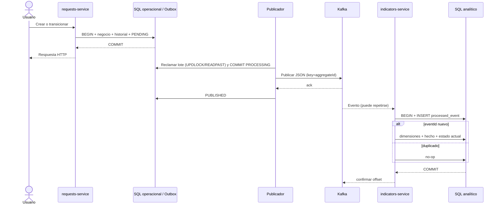

# Flujo principal

```mermaid
sequenceDiagram
 actor U as Usuario
 participant R as requests-service
 participant O as SQL operacional / Outbox
 participant P as Publicador
 participant K as Kafka
 participant I as indicators-service
 participant A as SQL analítico
 U->>R: Crear o transicionar
 R->>O: BEGIN + negocio + historial + PENDING
 O-->>R: COMMIT
 R-->>U: Respuesta HTTP
 P->>O: Reclamar lote (UPDLOCK/READPAST) y COMMIT PROCESSING
 P->>K: Publicar JSON (key=aggregateId)
 K-->>P: ack
 P->>O: PUBLISHED
 K-->>I: Evento (puede repetirse)
 I->>A: BEGIN + INSERT processed_event
 alt eventId nuevo
  I->>A: dimensiones + hecho + estado actual
 else duplicado
  I->>A: no-op
 end
 A-->>I: COMMIT
 I-->>K: confirmar offset
```
