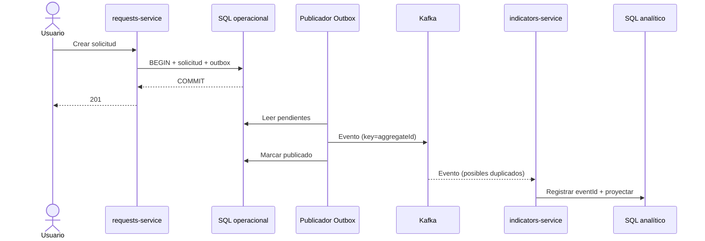

# Flujo principal

```mermaid
sequenceDiagram
 actor U as Usuario
 participant R as requests-service
 participant DB as SQL operacional
 participant P as Publicador Outbox
 participant K as Kafka
 participant I as indicators-service
 participant A as SQL analítico
 U->>R: Crear solicitud
 R->>DB: BEGIN + solicitud + outbox
 DB-->>R: COMMIT
 R-->>U: 201
 P->>DB: Leer pendientes
 P->>K: Evento (key=aggregateId)
 P->>DB: Marcar publicado
 K-->>I: Evento (posibles duplicados)
 I->>A: Registrar eventId + proyectar
```
